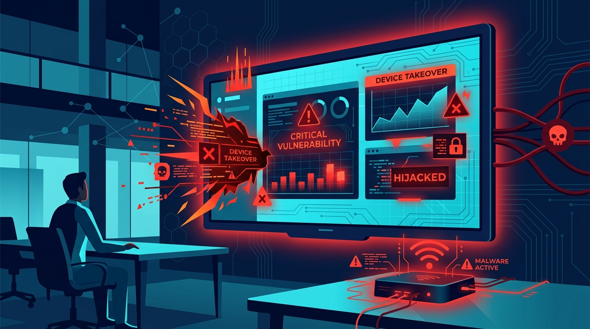

# ViewSonic vCast Vulnerabilities (Device Takeover)

Multiple critical security flaws have been discovered in ViewSonic's vCast software, a popular wireless presentation application used extensively in corporate and educational environments. These vulnerabilities can be chained together by unauthenticated attackers to achieve complete device takeover, allowing them to spy on presentations, hijack displays, and pivot into the broader corporate network.\n\nOur latest security advisory details the technical mechanics of the exploit chain, the specific vCast versions impacted, and the immediate firmware updates and network isolation strategies IT administrators must implement.\n\nRead the full vulnerability analysis and patching guide on our official security portal.

**[Read the full technical breakdown here](https://cyberupdates365.com/viewsonic-vcast-vulnerabilities-device-takeover/)**

---
*Maintained by Kiran Sonawane | Senior Cloud & DevOps Engineer*
